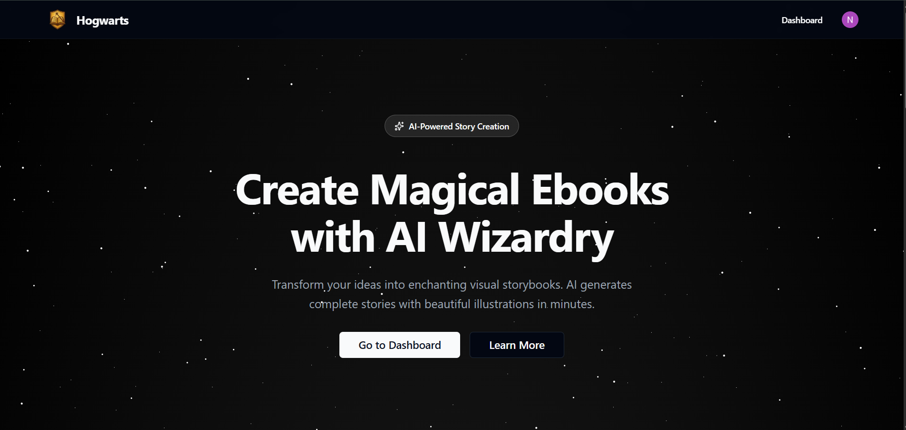
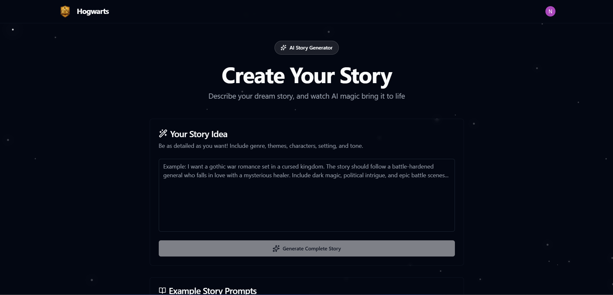
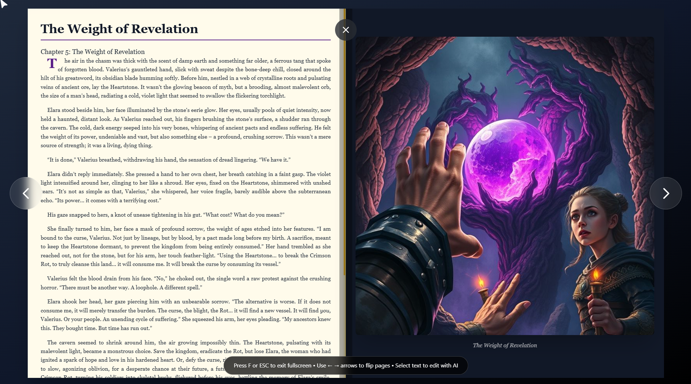
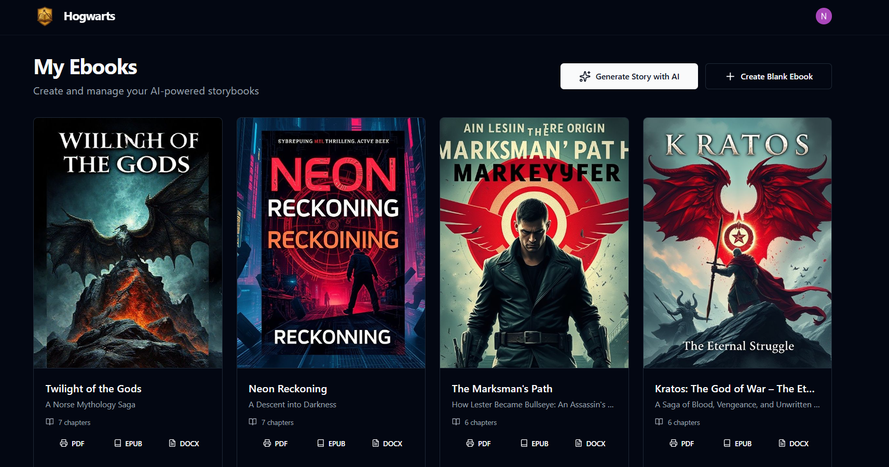

<div align="center">

# ✨ Hogwarts

### *AI-Powered Visual Storybook Creator*

[](https://nextjs.org/)
[](https://www.typescriptlang.org/)
[](https://tailwindcss.com/)
[](https://supabase.com/)
[](LICENSE)

**Transform ideas into enchanting illustrated ebooks in minutes** 🪄

[🚀 Live Demo](https://hogwarts-stories.vercel.app) • [📖 Documentation](https://github.com/theanarchist123/Hogwarts/wiki) • [🐛 Report Bug](https://github.com/theanarchist123/Hogwarts/issues) • [💡 Request Feature](https://github.com/theanarchist123/Hogwarts/issues)


</div>

---

## 📖 Table of Contents

- [About](#-about-the-project)
- [Features](#-features)
- [Demo](#-demo)
- [Tech Stack](#️-tech-stack)
- [Getting Started](#-getting-started)
- [Usage Guide](#-usage-guide)
- [Project Structure](#-project-structure)
- [API Integration](#-api-integration)
- [Roadmap](#-roadmap)
- [Contributing](#-contributing)
- [License](#-license)

---

## 🎭 About The Project

> **Hogwarts** is a revolutionary AI-powered platform that transforms simple text prompts into complete, beautifully illustrated storybooks. Whether you're an author seeking inspiration, an educator creating engaging content, or a creative soul with stories to tell—Hogwarts brings your imagination to life with cutting-edge AI technology.

### ✨ What Makes It Magical?

**From Prompt to Published in 3 Minutes**

Traditional storybook creation takes weeks or months. Hogwarts does it in minutes:

1. 📝 **You write** a simple story idea
2. 🤖 **AI crafts** complete narrative with plot, characters, and dialogue
3. 🎨 **AI illustrates** every chapter with stunning artwork
4. 📖 **You read** in an immersive flip-book experience
5. 📥 **You export** as EPUB, DOCX, or PDF

No design skills. No coding. No waiting. Just pure creativity unleashed.

---

## 🎯 Features

### 🤖 **Advanced AI Story Generation**
- **Multi-Chapter Narratives**: Generate 5-7 coherent chapters with plot progression
- **Genre Flexibility**: Fantasy, Sci-Fi, Mystery, Romance, Adventure, and more
- **Character Development**: AI creates consistent characters with depth
- **Powered by Groq**: Lightning-fast Llama 3.3 70B model for superior quality

### 🎨 **Automatic Illustration Generation**
- **Chapter-Specific Artwork**: Every chapter gets unique, contextual illustrations
- **Multiple AI Providers**: Google Imagen AI for photorealistic images
- **Style Consistency**: Maintains visual coherence throughout your story
- **High Resolution**: Publication-ready image quality

### 📖 **Immersive Reading Experience**
- **Realistic Flip-Book**: Page-turning animations that mimic physical books
- **Two-Page Spread View**: Desktop experience with dual-page layout
- **Responsive Design**: Optimized for mobile, tablet, and desktop
- **Dark/Light Themes**: Eye-friendly reading in any environment

### ✨ **AI-Powered Inline Editing**
- **Select & Enhance**: Highlight text and get AI suggestions
- **Multiple Improvement Options**: Tone, clarity, creativity, or length adjustments
- **Real-time Updates**: See changes instantly in the editor
- **Context-Aware**: AI understands your story's context for better edits

### 📥 **Export & Publishing**
- **EPUB Format**: Industry-standard for all e-readers
- **DOCX Export**: For further editing in Word/Google Docs
- **PDF Generation**: Print-ready with professional formatting
- **One-Click Download**: Export your entire book instantly

### 🔐 **Secure & Scalable**
- **User Authentication**: Secure login via Clerk with social sign-in
- **Personal Library**: All your stories saved and accessible
- **Cloud Storage**: Powered by Supabase with row-level security
- **Fast Performance**: Optimized with Next.js 14 App Router

---

## 🎬 Demo

<div align="center">

### 🖼️ Screenshots

<table>
<tr>
<td width="100%">

<p align="center"><strong>✨ Beautiful Landing Page</strong></p>
</td>
</tr>
<tr>
<td width="100%">

<p align="center"><strong>🪄 Story Generator</strong></p>
</td>
</tr>
<tr>
<td width="100%">

<p align="center"><strong>📖 Flip Book Reader</strong></p>
</td>
</tr>
<tr>
<td width="100%">

<p align="center"><strong>📚 Personal Dashboard</strong></p>
</td>
</tr>
</table>


</div>

---

## 🛠️ Tech Stack

<div align="center">

### Frontend


### Backend & Database


### AI & APIs


### Authentication & Deployment


</div>

<table>
<tr>
<td align="center" width="150"><strong>Framework</strong></td>
<td>Next.js 14 with App Router, React 18, TypeScript</td>
</tr>
<tr>
<td align="center"><strong>AI Models</strong></td>
<td>Groq (Llama 3.3 70B Versatile), Google Imagen AI, Gemini 1.5 Pro</td>
</tr>
<tr>
<td align="center"><strong>Database</strong></td>
<td>Supabase (PostgreSQL) with Row Level Security (RLS)</td>
</tr>
<tr>
<td align="center"><strong>Authentication</strong></td>
<td>Clerk (Email, Google, GitHub OAuth)</td>
</tr>
<tr>
<td align="center"><strong>Styling</strong></td>
<td>Tailwind CSS, Shadcn/ui Components, Custom Animations</td>
</tr>
<tr>
<td align="center"><strong>Deployment</strong></td>
<td>Vercel (Edge Functions, Serverless)</td>
</tr>
<tr>
<td align="center"><strong>Export Libraries</strong></td>
<td>EPUBjs, Docx.js, HTML2PDF</td>
</tr>
</table>

---

## 🚀 Getting Started

### Prerequisites

Before you begin, ensure you have:

- **Node.js** 18+ and npm/yarn installed
- **Git** for version control
- API keys for the following services:
  - [Clerk](https://clerk.com) (Authentication)
  - [Supabase](https://supabase.com) (Database)
  - [Groq](https://console.groq.com) (AI Story Generation)
  - [Google AI Studio](https://aistudio.google.com) (Image Generation)

### Installation

1️⃣ **Clone the repository**

```bash
git clone https://github.com/theanarchist123/Hogwarts.git
cd Hogwarts
```

2️⃣ **Install dependencies**

```bash
npm install
# or
yarn install
# or
pnpm install
```

3️⃣ **Set up environment variables**

Create a `.env.local` file in the root directory:

```env
# Authentication (Clerk)
NEXT_PUBLIC_CLERK_PUBLISHABLE_KEY=pk_test_your_key_here
CLERK_SECRET_KEY=sk_test_your_key_here

# Database (Supabase)
NEXT_PUBLIC_SUPABASE_URL=https://your-project.supabase.co
NEXT_PUBLIC_SUPABASE_ANON_KEY=your_anon_key_here
SUPABASE_SERVICE_ROLE_KEY=your_service_role_key_here

# AI Services
GROQ_API_KEY=gsk_your_groq_key_here
GOOGLE_GENERATIVE_AI_API_KEY=AIza_your_gemini_key_here
IMAGEN_AI_KEY=AIza_your_imagen_key_here
```

4️⃣ **Set up Supabase database**

Run the SQL schema from `supabase/schema.sql` in your Supabase SQL Editor:

```sql
-- Creates tables: ebooks, chapters, user_preferences
-- Enables Row Level Security (RLS)
-- Sets up indexes and constraints
```

5️⃣ **Run the development server**

```bash
npm run dev
```

6️⃣ **Open your browser**

Navigate to [http://localhost:3000](http://localhost:3000) 🎉

---

## 📘 Usage Guide

### Creating Your First Story

1. **Sign Up/Login**: Click "Get Started" and create your account
2. **Navigate to Generator**: Go to Dashboard → "Create New Story"
3. **Enter Your Prompt**: 
   ```
   Example: "A young wizard discovers a hidden library that contains 
   books from parallel universes. Write a mystery adventure story."
   ```
4. **Configure Options**:
   - Number of chapters (5-7)
   - Story tone (Light, Dark, Humorous, Serious)
   - Target audience (Kids, Teens, Adults)
5. **Generate**: Click "Generate Story" and wait 2-3 minutes
6. **Review**: AI creates your complete story with illustrations

### Reading & Editing

1. **Open Story**: Click on any story in your dashboard
2. **Flip Through Pages**: Use arrow keys or click page corners
3. **AI Edit Mode**: 
   - Select any text
   - Click "Improve with AI"
   - Choose enhancement type
   - Accept or reject changes
4. **Save Changes**: Auto-saves every edit

### Exporting Your Story

1. **Open Story**: Navigate to your completed story
2. **Export Options**:
   - **EPUB**: Best for Kindle, Apple Books, Google Play Books
   - **DOCX**: For editing in Microsoft Word
   - **PDF**: For printing or sharing
3. **Download**: Click format → Download starts automatically

---

## 📁 Project Structure

```
Hogwarts/
├── app/                          # Next.js App Router
│   ├── (auth)/                   # Authentication routes
│   │   ├── sign-in/
│   │   └── sign-up/
│   ├── api/                      # API routes
│   │   ├── ai/                   # AI generation endpoints
│   │   │   ├── chapter/
│   │   │   ├── image/
│   │   │   └── outline/
│   │   ├── chapters/             # Chapter CRUD
│   │   ├── ebooks/               # Ebook CRUD
│   │   └── export/               # Export handlers
│   │       ├── epub/
│   │       ├── docx/
│   │       └── pdf/
│   ├── dashboard/                # User dashboard
│   ├── editor/                   # Story editor
│   ├── generate/                 # Story generator
│   ├── read/                     # Flip-book reader
│   ├── layout.tsx                # Root layout
│   └── page.tsx                  # Landing page
├── components/                   # React components
│   ├── ui/                       # Shadcn components
│   ├── animate-ui/               # Animation components
│   ├── Navbar.tsx
│   ├── TestimonialsMarquee.tsx
│   └── FeatureFlipCard.tsx
├── lib/                          # Utility functions
│   ├── ai-providers.ts           # AI service integrations
│   ├── supabase.ts               # Supabase client
│   └── utils.ts
├── hooks/                        # Custom React hooks
├── public/                       # Static assets
├── supabase/
│   └── schema.sql                # Database schema
└── docs/                         # Documentation
```

## 🤝 Contributing

Contributions are what make the open-source community amazing! Any contributions you make are **greatly appreciated**.

### How to Contribute

1. **Fork the Project**
2. **Create your Feature Branch**
   ```bash
   git checkout -b feature/AmazingFeature
   ```
3. **Commit your Changes**
   ```bash
   git commit -m 'Add some AmazingFeature'
   ```
4. **Push to the Branch**
   ```bash
   git push origin feature/AmazingFeature
   ```
5. **Open a Pull Request**

### Development Guidelines

- Follow TypeScript best practices
- Use Tailwind CSS for styling
- Write meaningful commit messages
- Add tests for new features
- Update documentation as needed

---

## 📄 License

Distributed under the **MIT License**. See `LICENSE` file for more information.

This means you can:
- ✅ Use commercially
- ✅ Modify
- ✅ Distribute
- ✅ Private use

---

## 🙏 Acknowledgments

- [Next.js](https://nextjs.org/) - The React Framework
- [Groq](https://groq.com/) - Lightning-fast AI inference
- [Supabase](https://supabase.com/) - Open source Firebase alternative
- [Clerk](https://clerk.com/) - Authentication made easy
- [Shadcn/ui](https://ui.shadcn.com/) - Beautiful component library
- [Tailwind CSS](https://tailwindcss.com/) - Utility-first CSS framework

---

## 📬 Contact & Support

<div align="center">

**Questions? Issues? Feature Requests?**

[](https://github.com/theanarchist123/Hogwarts/issues)
[](mailto:your-email@example.com)

**Show your support!**

If you find Hogwarts helpful, please consider:
- ⭐ Starring this repository
- 🐦 Sharing on social media
- 💬 Spreading the word to fellow creators

---

**Made with** ❤️ **and a lot of** ☕ **by** [theanarchist123](https://github.com/theanarchist123)

*"Any sufficiently advanced technology is indistinguishable from magic."* - Arthur C. Clarke

</div>
